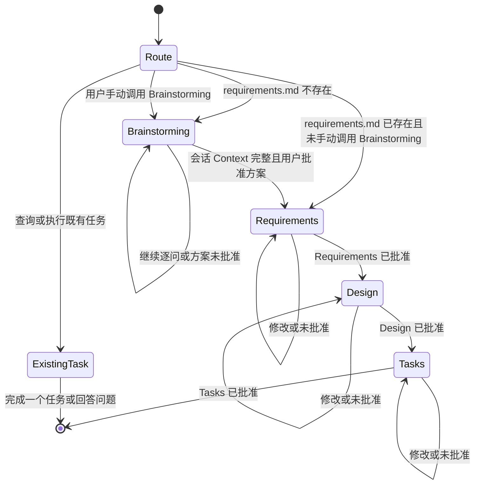

# LazySpec 职责拆分设计文档

## Overview

LazySpec 将现有单文件 `spec/SKILL.md` 拆分为一个核心路由 Skill、一个会话内 Brainstorming Skill，以及三个阶段写作 Skill。拆分后的默认流程为：

```text
Brainstorming → Requirements → Design → Tasks
```

本设计遵守两条边界：

1. 除新增 Brainstorming 和必要路由外，原 `spec/SKILL.md` 的英文正文只做物理迁移，不做改写、纠错、翻译、格式化或去重。
2. 本阶段只生成 `specs/lazyspec/design.md`，不创建、移动、重命名或修改任何 Skill 文件。

### 调研结论

- [OpenAI Build skills](https://learn.chatgpt.com/docs/build-skills) 将 Skill 定义为包含 `SKILL.md` 的独立目录，要求 YAML frontmatter 至少提供 `name` 和 `description`，并建议每个 Skill 聚焦单一工作目标。
- 官方文档支持在 `SKILL.md` 旁放置支持资源，并要求 `SKILL.md` 说明何时读取它们。LazySpec 据此把 Prompt 和 Template 从阶段正文中拆出，并由对应写作 Skill 显式加载。
- 官方文档明确列出 `$HOME/.agents/skills` 等扫描根目录，但没有明确保证递归发现 `$HOME/.agents/skills/LazySpec/*/SKILL.md`。因此嵌套发现属于必须实测的兼容性风险；验证失败时不得调整用户指定结构，也不得删除原 `spec` Skill。
- 本地 `skill-creator` 建议保持 `SKILL.md` 精简并使用渐进披露。将三个阶段的 Prompt 和 Template 拆出可降低单次加载上下文，同时不改变原始文字。

## Architecture

### 目标目录

```text
/Users/sawyerlau/.agents/skills/
├── spec/
│   └── SKILL.md                    # 验证全部通过前保留
└── LazySpec/
    ├── using-lazyspec/
    │   └── SKILL.md
    ├── brainstorming/
    │   └── SKILL.md
    ├── writing-requirement/
    │   ├── SKILL.md
    │   ├── requirement-prompt.md
    │   └── requirement-templete.md
    ├── writing-design/
    │   ├── SKILL.md
    │   ├── design-prompt.md
    │   └── design-templete.md
    └── writing-task/
        ├── SKILL.md
        ├── task-prompt.md
        └── task-templete.md
```

`LazySpec` 只是集合目录，不是可调用 Skill；其五个子目录分别是独立 Skill。除上图文件外不创建 `agents/openai.yaml`、README、脚本或其他辅助文件。

### 工作流



### 核心设计决策

1. **路由与写作分离**：`using-lazyspec` 只判断入口、阶段和审批状态，不承载三个写作阶段的详细正文。
2. **Brainstorming 独立但不持久化**：`brainstorming` 产生会话 Context，不创建任何文件；`writing-requirement` 直接消费该 Context。
3. **原文以区块为迁移单位**：从原 `SKILL.md` 提取完整连续区块放入唯一目标文件，不在多个文件间复制相同原文。
4. **新增文字最小化**：每个新 `SKILL.md` 只新增合法 frontmatter、加载支持文件的指令和跨 Skill 路由引用。
5. **兼容性验证先于替换**：嵌套 Skill 发现、格式校验、内容守恒和基本路由验证全部通过前，原 `spec` Skill 保持原路径与内容不变。

## Components and Interfaces

### `using-lazyspec/SKILL.md`

职责：

- 作为 LazySpec 的统一入口。
- 检查目标功能的 `requirements.md`、`design.md` 和 `tasks.md` 是否存在及是否已获批准。
- 首次创建 `requirements.md` 时路由到 `brainstorming`。
- 修改既有 Requirements 时默认直接路由到 `writing-requirement`；只有用户显式要求时才重新 Brainstorming。
- 保留原 Skill 的全局规则、流程图、Task Instructions、Task Questions 和单任务执行限制。

输入：用户请求、当前会话状态、Spec 文件状态。

输出：一个阶段路由决定，或对既有任务问题的回答／单任务执行结果。

禁止：复制三个写作 Skill 或 Brainstorming 的完整阶段正文；绕过审批门；一次执行多个任务。

### `brainstorming/SKILL.md`

职责：

- 参考 `superpowers:brainstorming` 的项目探索、逐问澄清、2–3 个方案比较和用户确认机制。
- 优先使用可用的问答 Tool；没有合适 Tool 时直接在会话中一次询问一个问题。
- 形成包含目标、范围、约束、成功标准和选定方案的会话 Context。

输入：用户初始想法、相关项目文件、现有 Spec Context。

输出：用户已确认的 `BrainstormingContext`，只存在于当前会话。

禁止：写入 Brainstorming 或 Design 文档、创建临时文件、提交 Git、调用 `writing-plans`、开始实现。

### `writing-requirement`

文件职责：

- `SKILL.md`：承载 Requirement Gathering 的阶段规则、验收循环与 Requirements Clarification Stalls。
- `requirement-prompt.md`：承载原 Requirement Gathering 中驱动首次需求生成的提示文字。
- `requirement-templete.md`：承载原 Requirements Document 示例代码块。

输入：首次创建时为已确认的 `BrainstormingContext`；修订时为现有 `requirements.md` 与用户反馈。

输出：`specs/{feature_name}/requirements.md`，以及等待用户明确批准的审批请求。

### `writing-design`

文件职责：

- `SKILL.md`：承载 Create Feature Design Document 的阶段规则、审批循环、Research Limitations 和 Design Complexity。
- `design-prompt.md`：承载原 Design 阶段的入口提示文字。
- `design-templete.md`：承载原 Design 文档必需章节列表。

输入：已批准的 `requirements.md`。

输出：`specs/{feature_name}/design.md`，以及等待用户明确批准的审批请求。

### `writing-task`

文件职责：

- `SKILL.md`：承载 Create Task List 的阶段规则、约束和审批循环。
- `task-prompt.md`：承载原文中面向代码生成 LLM 的实施计划 Prompt。
- `task-templete.md`：承载原 Implementation Plan 示例代码块。

输入：已批准的 `requirements.md` 和 `design.md`。

输出：`specs/{feature_name}/tasks.md`，以及等待用户明确批准的审批请求。

## Source Content Allocation

拆分以原 `/Users/sawyerlau/.agents/skills/spec/SKILL.md` 为唯一迁移来源。以下区块只描述归属，不授权改写内容：

| 原始区块 | 唯一目标 |
|---|---|
| 原 Skill 的 Goal、Rule、Workflow 总览与全局 Rules | `using-lazyspec/SKILL.md` |
| Requirement Gathering 的生成提示 | `writing-requirement/requirement-prompt.md` |
| Requirement Gathering 的阶段约束、审批循环 | `writing-requirement/SKILL.md` |
| Requirements Document 示例代码块 | `writing-requirement/requirement-templete.md` |
| Create Feature Design Document 的入口提示 | `writing-design/design-prompt.md` |
| Design 阶段约束与审批循环 | `writing-design/SKILL.md` |
| Design 必需章节列表 | `writing-design/design-templete.md` |
| Create Task List 的入口文字及代码生成 LLM Prompt | `writing-task/task-prompt.md` |
| Task 阶段约束与审批循环 | `writing-task/SKILL.md` |
| Implementation Plan 示例代码块 | `writing-task/task-templete.md` |
| Requirements Clarification Stalls | `writing-requirement/SKILL.md` |
| Research Limitations、Design Complexity | `writing-design/SKILL.md` |
| Workflow Diagram、Task Instructions、Task Questions、IMPORTANT EXECUTION INSTRUCTIONS | `using-lazyspec/SKILL.md` |

原 YAML frontmatter 不作为正文区块迁移：

- `using-lazyspec` 使用新的 `name`，并可逐字复用原 `description` 作为描述内容。
- 其余四个 Skill 使用与目录一致的新 `name` 和只描述本职责的新 `description`。
- 五个 Skill 的正文仍使用英文；新增路由和加载文字也使用英文，以满足迁移后 Skill 语言保持英文的要求。

## Data Models

这些模型是 Skill 间的逻辑契约，不创建代码文件或持久化数据。

### `RouteDecision`

```ts
interface RouteDecision {
    readonly stage:
        | "brainstorming"
        | "requirements"
        | "design"
        | "tasks"
        | "existing-task";
    readonly reason: string;
}
```

### `BrainstormingContext`

```ts
interface BrainstormingContext {
    readonly objective: string;
    readonly scope: readonly string[];
    readonly constraints: readonly string[];
    readonly successCriteria: readonly string[];
    readonly selectedApproach: string;
    readonly approved: true;
}
```

该对象仅表示当前会话内必须具备的信息，不序列化、不落盘。只要任一字段缺失或方案未批准，路由不得进入 Requirements。

### `SpecArtifactState`

```ts
interface SpecArtifactState {
    readonly requirementsExists: boolean;
    readonly requirementsApproved: boolean;
    readonly designExists: boolean;
    readonly designApproved: boolean;
    readonly tasksExists: boolean;
    readonly tasksApproved: boolean;
}
```

审批状态以当前会话中用户的明确回复为准，不通过修改文件内容伪造持久化审批状态。

## Data Flow

### 首次创建 Requirements

1. `using-lazyspec` 确认目标 `requirements.md` 不存在。
2. 路由到 `brainstorming`。
3. `brainstorming` 检查相关项目 Context，并逐问澄清。
4. `brainstorming` 提出 2–3 个方案和推荐方案。
5. 用户明确选择或批准方案。
6. `BrainstormingContext` 留在当前会话中。
7. `using-lazyspec` 路由到 `writing-requirement`。
8. `writing-requirement` 读取自身 Prompt 与 Template，以 `BrainstormingContext` 生成 `requirements.md`。
9. Requirements 进入原有审批循环。

### 修改既有 Requirements

1. `using-lazyspec` 确认 `requirements.md` 已存在。
2. 默认直接路由到 `writing-requirement`。
3. 如果用户显式调用 Brainstorming，则先生成新的会话 Context；只有用户另行要求修改 Requirements 时才写文件。

### Design 与 Tasks

- Requirements 明确批准后才能路由到 `writing-design`。
- Design 明确批准后才能路由到 `writing-task`。
- 每个写作 Skill 只读取本阶段必要的 Skill、Prompt、Template 和上游 Spec，不加载其他阶段正文。

## Error Handling

### 嵌套 Skill 无法发现

- 先验证五个 `LazySpec/*/SKILL.md` 是否出现在当前运行环境的 Skill 列表中。
- 任一 Skill 未被发现时，停止替换流程并报告兼容性问题。
- 不移动子 Skill 到根目录，不改变 `LazySpec` 目录名，不删除或覆盖原 `spec` Skill。

### 原文守恒失败

- 任一区块缺失、重复或文本不一致时，验证失败。
- 失败后只修正拆分操作，不得修改原文以使验证通过。
- 全部区块通过前，原 `spec/SKILL.md` 始终是恢复基线。

### Brainstorming 不完整

- 用户未批准方案时继续澄清，不进入 Requirements。
- 没有问答 Tool 时退回会话提问，不把工具缺失视为失败。
- Context 丢失时重新执行 Brainstorming，不从磁盘恢复或伪造结果。

### 上游文档或审批缺失

- Design 缺少已批准 Requirements 时停止并请求用户先完成 Requirements。
- Tasks 缺少已批准 Design 时停止并请求用户先完成 Design。
- 不从文件存在这一事实推断用户已经批准。

### 原 Skill 与新增行为冲突

- 原 Requirement Gathering 中“先生成初稿”的行为仍保留在 `writing-requirement` 内。
- Brainstorming 作为独立上游阶段先完成；进入 `writing-requirement` 后，该 Skill 仍按原文直接生成需求初稿，因此无需修改原句。
- 除这一显式新增的前置路由外，任何需要改变原文才能成立的设计都必须停止并返回 Requirements 修订。

## Testing Strategy

### 1. 结构验证

- 校验目标目录与需求中的树完全一致。
- 校验恰好存在五个 `SKILL.md`、三个 Prompt 和三个 Template。
- 校验三个 Prompt 均使用 `.md` 扩展名，并保留 `templete` 拼写。
- 校验没有生成需求之外的文件。

### 2. Skill 格式验证

- 对五个 Skill 分别运行 `quick_validate.py`。
- 校验每个 `name` 与所属子目录一致。
- 校验每个 `description` 清楚限定触发条件，避免写作 Skill 互相误触发。
- 校验五个 Skill 正文为英文。

### 3. 原文守恒验证

- 在拆分前记录原 `spec/SKILL.md` 的 SHA-256，确保实施过程中源文件未改变。
- 按 Source Content Allocation 对每个原始连续区块与目标区块执行逐字节比较。
- 校验每个原始正文区块恰好命中一个目标文件。
- 将新增 frontmatter、路由引用、加载指令和 Brainstorming 正文排除在原文比对集合之外，并单独审查。

### 4. 发现验证

- 在支持重新加载 Skill 的环境中检查五个嵌套 Skill 是否均可显式调用。
- 分别使用应触发和不应触发的请求验证 description 边界。
- 发现验证失败时保留原 Skill 并报告，不改变目录结构。

### 5. 工作流场景验证

- `requirements.md` 不存在：必须先 Brainstorming，再 Requirements。
- `requirements.md` 已存在：默认直接修改 Requirements。
- 已存在 Requirements 且用户手动调用 Brainstorming：只更新会话 Context，不自动写文件。
- 问答 Tool 可用与不可用：分别验证 Tool 和会话问答回退路径。
- Brainstorming 方案未批准：不得进入 Requirements。
- Requirements、Design 未批准：不得越过各自审批门。
- 既有任务查询：只回答问题，不开始实现。
- 指定任务执行：一次只执行一个任务并停止。

### 6. 替换门

只有以下条件全部满足，才允许在后续明确授权下处理原 `spec` Skill：

1. 目标结构验证通过。
2. 五个 Skill 格式验证通过。
3. 原文守恒验证通过。
4. 五个嵌套 Skill 发现验证通过。
5. 核心路由场景验证通过。

本设计不授权删除原 `spec` Skill；如何处理旧目录必须由后续明确任务决定。
