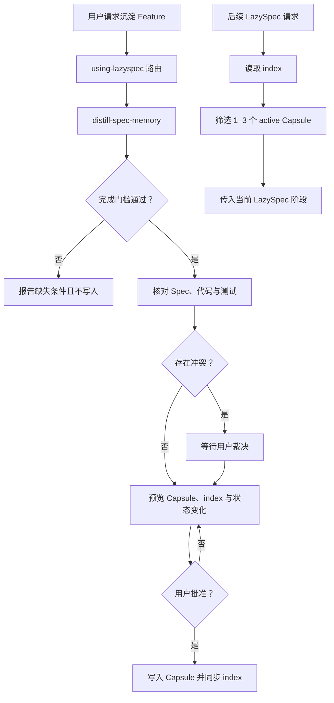

# 项目记忆体系设计

## Overview

本设计新增 `distill-spec-memory` Skill，并在 `using-lazyspec` 中加入轻量 Memory 路由。沉淀流程把已完成 Feature 的 Spec、实现和测试证据整理为不可变 Feature Capsule；读取流程只扫描 `project-memory/index.md`，再加载一至三份相关 `active` Capsule。MVP 不实现 Topic 层、sessions 或 JSON 索引，覆盖需求 1–7。

## Architecture



仓库内新增或修改的组件：

```text
LazySpec/
├── distill-spec-memory/
│   ├── SKILL.md
│   ├── agents/openai.yaml
│   └── references/memory-format.md
├── using-lazyspec/SKILL.md
├── .claude-plugin/plugin.json
└── tests/
    └── test_memory_contracts.py
```

`project-memory/` 不属于 LazySpec 仓库资产；它由 Skill 在用户的 `ACTIVE_PROJECT_ROOT` 下按需创建。

## Key Design Decisions

### 1. 一个写入 Skill，读取能力留在统一入口

`distill-spec-memory` 是唯一新增的可调用 Skill，负责需求 1–6。`using-lazyspec` 增加该 Skill 的注册解析和 Memory 读取协议，负责需求 7。写入与读取分离可避免普通 Spec 阶段误触发沉淀，也无需再增加独立 recall Skill。

Plugin manifest 增加 `./distill-spec-memory`。`using-lazyspec` 的平台无关解析表同时增加注册名称 `lazyspec:distill-spec-memory` 和 sibling fallback `../distill-spec-memory/SKILL.md`。

### 2. Skill 采用渐进披露

`SKILL.md` 只保留项目根绑定、完成门槛、证据核对、审批门、写入顺序和错误处理。固定的 Capsule frontmatter、正文结构、index 表格和状态不变量放入 `references/memory-format.md`，仅在生成预览或验证写入时读取。`agents/openai.yaml` 只保存 UI 所需的 `display_name`、`short_description` 和 `default_prompt`。

实现时使用 `skill-creator` 的初始化与校验脚本创建并验证 Skill，生成 `openai.yaml` 前读取其字段规范。Skill frontmatter 只保留 `name` 与包含明确触发场景的 `description`。

### 3. 完成门槛在任何候选生成之前执行

沉淀开始后依次验证三个 Spec 文件、Tasks checkbox、相关验证证据和用户完成确认。任一条件不满足即停止，且不得创建 `project-memory/` 或 draft 文件。验证证据优先来自 Design/Tasks 指定的自动化检查及其当前运行结果；无法安全重跑时请求用户提供或确认证据。[req-2-1 至 req-2-4]

### 4. 使用会话内 Evidence Matrix 核对结论

候选结论先在会话内形成逻辑 Evidence Matrix，每项记录 `claim`、Spec anchors、实现路径、测试路径和可选用户裁决。只有至少一个意图来源与一个现实来源相互支持，或用户对差异作出明确裁决，结论才能进入候选 Capsule。该矩阵不落盘，来源链接写入 Capsule。[req-3-1 至 req-3-4]

核对范围以 Spec 引用和任务改动为起点，再对候选结论做定向搜索；不要求扫描整个仓库。发现 Spec 与实现冲突时，预览前先单独解决冲突，避免把未经确认的选择藏进摘要。

### 5. 预览是唯一写入审批门

预览包含完整候选 Capsule、index 新增或修改行、旧 Capsule 状态变化、冲突裁决和来源列表。预览保留在会话中，不创建 draft。用户请求修改时重新生成预览；只有对当前版本明确批准后才形成一个逻辑写入集。[req-4-1 至 req-4-4]

写入集先在内存中完成路径、链接、状态和唯一性校验，再尽可能以单个 patch 应用。若工具不能原子应用且出现部分失败，Skill 必须报告已变更文件并停止，不得更新剩余文件或声称成功。

### 6. Capsule 正文冻结，状态元数据可演化

每个已批准 Feature 对应一个 Capsule。后续 Feature 产生新 Capsule；旧正文不改写，只允许状态、`status_reason`、`superseded_by` 和经批准的维护性纠错发生变化。`superseded` 必须引用替代 Capsule，`obsolete` 必须说明失效原因，`needs-review` 必须说明复审原因。[req-6-1 至 req-6-5]

每次状态变化必须在同一写入集中同步 Capsule 与 index。普通检索只读取 `active`；其他状态仅在用户要求历史追溯或复审时加载，并显式携带状态警告。

### 7. index 是唯一粗筛入口

`using-lazyspec` 在路由当前阶段前检查 `ACTIVE_PROJECT_ROOT/project-memory/index.md`。文件不存在时保持原流程；存在时按请求中的 Feature 名称、tags、摘要和 source Spec 选择最多三项 `active` Memory，再读取正文并形成会话内 `RelevantMemoryContext`。[req-7-1 至 req-7-5]

默认不扫描 `features/` 补偿损坏的 index，也不加载所有 Capsule。index 与 Capsule 不一致时停止使用该项并报告维护问题，避免用猜测掩盖漂移。

## Components and Interfaces

### `distill-spec-memory/SKILL.md`

输入为用户指定的 Feature、当前会话中的完成确认，以及 `ACTIVE_PROJECT_ROOT`。输出为阻断报告、待批准预览，或批准后的写入报告。主要阶段为 `gate → reconcile → deduplicate → preview → approve → write → verify`。

Skill 必须先读取完整 Spec，再读取 `references/memory-format.md`。检查已有 Memory 时先读 index，并按候选 tags、能力和来源选择可能冲突的 Capsule；不得为了去重加载整个库。

### `references/memory-format.md`

定义 Feature Capsule 与 index 的唯一格式、字段语义、允许状态转换、正文冻结边界及验证清单。此文件是 Skill 自身的格式 reference，不复制到用户项目。

### `using-lazyspec/SKILL.md`

增加两项职责：识别沉淀请求并路由到新 Skill；在其他 LazySpec 请求中生成 `RelevantMemoryContext`。该 Context 只存在于当前会话，路由后的阶段可将其作为已有项目约束使用，但不得据此绕过上游 Spec 或审批门。

### `RelevantMemoryContext`

```ts
interface RelevantMemoryContext {
  readonly query: string;
  readonly memories: readonly {
    path: string;
    status: "active";
    sourceSpec: string;
    relevantSections: readonly string[];
  }[]; // 默认 0–3 项
}
```

## Data Models

Feature Capsule 使用 YAML frontmatter 和固定 Markdown 章节：

```yaml
feature: <feature-name>
status: active
source_spec: specs/<feature-name>/
distilled_at: YYYY-MM-DD
tags: []
supersedes: []
superseded_by: []
status_reason: ""
```

正文顺序固定为 `Capability`、`Durable Decisions`、`Contracts and Invariants`、`Lessons`、`Reuse Triggers`、`Sources`。内容只保留未来任务需要且能追溯的结论，不复述 Requirements、Design 或 Tasks。[req-5-2、req-5-3、req-5-5]

`index.md` 使用固定表格：

```markdown
| Memory | Summary | Tags | Status | Source Spec |
|---|---|---|---|---|
| project-memory/features/<feature>.md | ... | ... | active | specs/<feature>/ |
```

所有路径使用相对 `ACTIVE_PROJECT_ROOT` 的 POSIX 风格路径。Memory 路径必须唯一，状态与 Capsule 一致，Summary 只用于路由，不承载长期结论。[req-5-1、req-5-4]

## Error Handling

- Spec 缺失、Tasks 未完成、验证无证据或用户未确认：返回具体门槛结果，不产生文件。
- Spec 与实现冲突：列出双方证据并等待裁决，不生成可批准预览。
- 来源缺失、链接越界或候选结论无证据：从候选中移除该结论并报告；若属于核心结论则停止。
- 目标 Capsule 已存在：不得覆盖正文；判断是维护性修正、状态更新还是重复沉淀，并要求对应审批。
- index 与 Capsule 状态不一致：标记维护错误，禁止把该项作为 `active` Memory 传入阶段。
- 非原子写入失败：报告实际文件状态并停止，由后续修复恢复一致性。

## Testing Strategy

1. **Skill 与 Plugin 合约**：验证 `distill-spec-memory` frontmatter、目录名、`agents/openai.yaml`、manifest 注册，以及 `using-lazyspec` 的注册名称和 sibling fallback，覆盖 req-1。
2. **完成门槛静态契约**：断言 Skill 明确要求三个 Spec、全部 Tasks、验证证据、用户确认，并在门槛失败时禁止任何正式或 draft 写入，覆盖 req-2、req-4。
3. **格式 reference**：解析示例 frontmatter 与 index 表头，验证四状态、状态必填关系、固定章节、项目根相对路径和唯一索引项，覆盖 req-5、req-6。
4. **不可变性回归**：使用 fixture 比较状态更新前后，确保正文不变且 Capsule/index 状态同步；验证 `superseded` 关系双向完整，覆盖 req-6。
5. **检索路由**：构造无 index、无命中、超过三项命中、历史状态命中和损坏 index 场景，验证只传递 0–3 个相关 `active` Capsule且原审批链不变，覆盖 req-7。
6. **仓库回归**：运行现有 `tests/test_skill_contracts.py`，并扩展注册数量、路由表和所有 Spec task `//TODO` 守恒检查，确保新功能不破坏既有行为。
