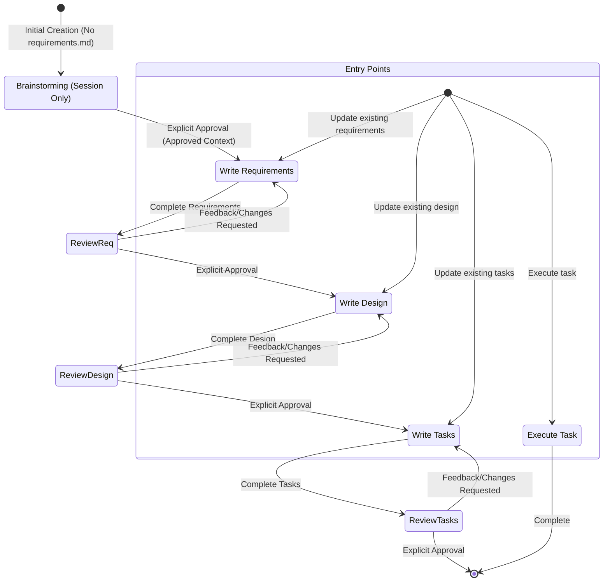

# LazySpec

## Rule
- The output content should all be in chinese, except the key word from the project

## Minimum-Sufficient Documentation
- Default to the shortest document that remains reviewable, verifiable, and executable.
- Put information in exactly one phase: Requirements define observable behavior, Design records implementation decisions, and Tasks identify coding actions and automated verification.
- Refer to upstream requirement IDs instead of restating upstream content. Do not repeat the same rationale, constraint, or procedure in multiple sections.
- Expand a section only when omitting it would create a material implementation ambiguity or the user explicitly requests more detail. An explicit request expands only the relevant section; it does not enable a separate verbose mode.
- Treat phase length targets as soft limits. Before exceeding one, remove repetition, merge closely related items, or recommend splitting an oversized Spec. Never truncate distinct approved behavior merely to meet a target.

## Routing Protocol
Use this Skill as the single entry point. Route by logical Skill name and read only that Skill's required resources; do not copy a phase's detailed body here.

Before inspecting or writing any Spec artifact, bind `ACTIVE_PROJECT_ROOT` to the user's project working directory at the start of the current agent session. Resolve every `specs/{feature_name}/...` path against that directory. Never derive `ACTIVE_PROJECT_ROOT` from this Skill's directory, a registered Skill location, the Plugin repository, or a Plugin cache. If the session working directory is unavailable or ambiguous, ask the user for the project root before writing; never default to the Plugin installation directory.

Resolve every routed Skill with this platform-neutral protocol:

1. Prefer the current environment's registered Skill invocation mechanism. Use the logical names `brainstorming`, `writing-requirement`, `writing-design`, and `writing-task`; a Claude Code Plugin may expose them as `lazyspec:<logical-name>`, while an Agent Skills installation may expose the unnamespaced logical name.
2. If no registered Skill invocation mechanism is available, or the logical Skill is not registered, read its sibling `SKILL.md` using the fallback mapping below. Resolve the path relative to this `using-lazyspec/SKILL.md`, never relative to the process working directory or repository root.
3. After resolving the target, follow that Skill's instructions and resolve its supporting files by the target Skill's own resource rules.

| Logical name | Registered Claude Code name | Relative fallback |
|---|---|---|
| `brainstorming` | `lazyspec:brainstorming` | `../brainstorming/SKILL.md` |
| `writing-requirement` | `lazyspec:writing-requirement` | `../writing-requirement/SKILL.md` |
| `writing-design` | `lazyspec:writing-design` | `../writing-design/SKILL.md` |
| `writing-task` | `lazyspec:writing-task` | `../writing-task/SKILL.md` |

Inspect the requested feature's `specs/{feature_name}/requirements.md`, `design.md`, and `tasks.md` under `ACTIVE_PROJECT_ROOT`, the user's request, and explicit approvals available in the current conversation. Do not infer approval from file existence.

1. For the first creation of `requirements.md`, when that file does not exist:
   - Route to `brainstorming`.
   - Do not route to `writing-requirement` until Brainstorming has an explicitly approved session context containing objective, scope, constraints, success criteria, and selected approach.
   - After the approved context is available, route to `writing-requirement`.

2. For a revision of an existing `requirements.md`:
   - Route directly to `writing-requirement` by default.
   - Route to `brainstorming` first only when the user explicitly requests it.
   - Brainstorming updates only conversation context; do not modify a Spec artifact unless separately requested.

3. For Design, route to `writing-design` only after Requirements has explicit user approval. For Tasks, route to `writing-task` only after Design has explicit user approval. Preserve each downstream Skill's approval gate.

4. For questions about existing Spec tasks or requests to execute an existing task, apply the task instructions below. Answer task questions without starting work, and execute only one requested task at a time.

## Workflow Diagram

## Task Instructions

### Executing Instructions
- Before executing any task, ALWAYS read the feature's complete `requirements.md`, `design.md`, and `tasks.md` in the current execution context. Executing a task without all three artifacts is forbidden.
- Look at the task details in the task list; start with sub-tasks if present.
- Only focus on ONE user-selected task at a time, including its listed sub-tasks. Do not implement functionality for sibling or subsequent tasks. If multiple tasks are requested, ask the user to select one and do not start implementation.
- Verify implementation against any requirements specified in the task or its details.
- When marking a completed task in `tasks.md`, change only its checkbox token from `[ ]` to `[x]`. Preserve `//TODO` and every character after it exactly; do not remove, replace, or rewrite the task text.
- Once you complete the requested task, stop and let the user review. DO NOT proceed to the next task automatically without user instruction.
- If the user doesn't specify which task to work on, recommend the next task from the list.

### Task Questions
Answer task-information requests without modifying code, Spec files, or checkbox state. For example, if the user asks what the next task is, provide the information without starting any task.

## Approval Protocol
After every Requirements, Design, or Tasks update or revision, request approval in this order:

1. If `AskUserQuestion` is available, call it with only its supported `questions` input. Use one question object with `question`, `header`, `options`, and `multiSelect`; use `Review` as the header, the two single-choice options `Approve` and `Request changes`, and `multiSelect: false`. Do not add unsupported top-level or question fields.
2. Otherwise, if the environment provides an equivalent user-question tool, use it with the same single-choice meaning and only fields supported by that tool.
3. Otherwise, ask the phase's approval question directly in the conversation and stop while awaiting the answer.

- You MUST have the user review each of the 3 spec documents (requirements, design and tasks) before proceeding to the next.
- Only an explicit approval in the current conversation (a clear "yes", "approved", selecting `Approve`, or equivalent affirmative response) records approval. File existence, timeout, silence, explanations, ambiguous replies, and requested changes do not imply approval.
- You MUST NOT proceed to the next phase until you receive explicit approval from the user.
- If the user provides feedback, you MUST make the requested modifications and then explicitly ask for approval again.
- Follow workflow steps sequentially without skipping or combining phases.
