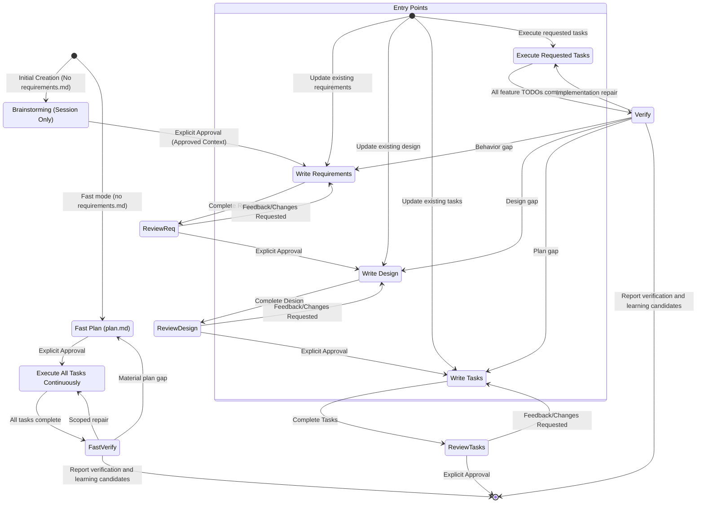

# LazySpec

## Rule
- The output content should all be in chinese, except the key word from the project

## Shared policies

Before routing planning, revision, or execution, read [risk-policy.md](references/risk-policy.md). Before planning Tasks or executing either mode, also read [delivery-loop.md](references/delivery-loop.md). These references define risk-based approval timing, success criteria, feature verification, repair routing, and learning candidates. Resolve them relative to this Skill; if unavailable, report the missing resource rather than inventing a policy.

## Minimum-Sufficient Documentation
- Default to the shortest document that remains reviewable, verifiable, and executable.
- Put information in exactly one phase: Requirements define observable behavior, Design records implementation decisions, and Tasks identify coding actions and automated verification.
- Other than the bounded Human-First `审批摘要` projection defined below, refer to upstream requirement IDs instead of restating upstream content. Do not repeat the same rationale, constraint, or procedure in multiple detailed sections.
- Expand a section only when omitting it would create a material implementation ambiguity or the user explicitly requests more detail. An explicit request expands only the relevant section; it does not enable a separate verbose mode.
- Treat phase length targets as soft limits. Before exceeding one, remove repetition, merge closely related items, or recommend splitting an oversized Spec. Never truncate distinct approved behavior merely to meet a target.

## Human-First Approval Contract

Apply this contract to generated or revised Requirements and Design documents. Brainstorming keeps its Context approval. Low-risk Spec approval combines both summaries with the Tasks plan; fast approves its plan, and Memory approves its exact write preview.

- Put a Chinese `审批摘要` at the top of each Requirements and Design document. It is the user-facing approval contract; the detailed body is the Agent-facing elaboration and MUST remain consistent with, and bounded by, the approved summary.
- Treat observable behavior, scope and exclusions, public interfaces or data changes, compatibility, external side effects, security or privacy, failure and recovery behavior, key technical choices, and their risks as material. Treat filenames, internal helpers, code organization, test layout, and equivalent implementation refinements as non-material only when they do not alter any material item. When uncertain, classify a change as material.
- Before requesting approval, verify internally that every material body item is represented directly or by one unambiguous group in `审批摘要`. A missing material item or any summary/body conflict blocks approval.
- Let the model adapt the summary to the feature's cognitive complexity instead of enforcing a fixed item or character count. Aim for a complete one-screen review. If that is impossible without hiding material information, pause approval and recommend splitting the Spec; expand the summary only after the user explicitly chooses to keep one Spec.
- Approval covers the current summary's material intent, decisions, and risks, plus the body's consistency with it. A material change invalidates the prior approval. A non-material body-only refinement that leaves the summary true and complete does not require reapproval.
- After a material revision, update the complete summary in the document and present a concise conversation delta covering additions, changes, removals, and risk changes before asking for approval again.
- Do not bulk-migrate existing Specs. Add `审批摘要` when a Requirements or Design document is next created or revised; an already approved legacy Requirements document may still be used to create Design without being rewritten.
- Every downstream phase MUST treat an approved `审批摘要` as the upper-level material contract while continuing to read the complete Spec body for implementation detail.

## Brainstorming Human-First Conversation Contract

Apply this contract only to the user-facing Brainstorming conversation. It does not create a new artifact, change the internal `BrainstormingContext` schema, or alter Requirements, Design, Tasks, fast mode, or Memory behavior.

- Lead with the result the user will experience, then explain the implementation mechanism only when it helps the current decision.
- Ask for exactly one decision in each question and state in plain language what that decision affects.
- Name options by user-visible outcomes. Describe the meaningful experience, cost, risk, or compatibility trade-off instead of using internal implementation labels.
- Use plain-language Chinese by default. When the user introduces technical terms or explicitly asks to go deeper, adapt to their level while keeping the answer concise and outcome-oriented.
- When a necessary technical term first appears, immediately add a short plain-language explanation.
- Proactively show technical details only when an implementation difference would materially change which option the user should choose. Leave non-decision-making details to Design.
- Plain language is a presentation rule, not a reason to omit substance. Preserve the feature's scope, observable behavior, constraints, risks, and success criteria.
- Before sending a Brainstorming question or comparison, self-check that the user can easily understand what they are deciding, the consequence of each option, and why the recommended option is recommended. Rewrite it first if any part is unclear.

## Routing Protocol
Use this Skill as the single entry point. Route by logical Skill name and read only that Skill's required resources; do not copy a phase's detailed body here.

Before inspecting or writing any Spec artifact, bind `ACTIVE_PROJECT_ROOT` to the user's project working directory at the start of the current agent session. Resolve every `specs/{feature_name}/...` path against that directory. Never derive `ACTIVE_PROJECT_ROOT` from this Skill's directory, a registered Skill location, the Plugin repository, or a Plugin cache. If the session working directory is unavailable or ambiguous, ask the user for the project root before writing; never default to the Plugin installation directory.

Resolve every routed Skill with this platform-neutral protocol:

1. Prefer the current environment's registered Skill invocation mechanism. Use the logical names `brainstorming`, `writing-requirement`, `writing-design`, `writing-task`, `distill-spec-memory`, and `fast`; a Claude Code Plugin may expose them as `lazyspec:<logical-name>`, while an Agent Skills installation may expose the unnamespaced logical name.
2. If no registered Skill invocation mechanism is available, or the logical Skill is not registered, read its sibling `SKILL.md` using the fallback mapping below. Resolve the path relative to this `using-lazyspec/SKILL.md`, never relative to the process working directory or repository root.
3. After resolving the target, follow that Skill's instructions and resolve its supporting files by the target Skill's own resource rules.

| Logical name | Registered Claude Code name | Relative fallback |
|---|---|---|
| `brainstorming` | `lazyspec:brainstorming` | `../brainstorming/SKILL.md` |
| `writing-requirement` | `lazyspec:writing-requirement` | `../writing-requirement/SKILL.md` |
| `writing-design` | `lazyspec:writing-design` | `../writing-design/SKILL.md` |
| `writing-task` | `lazyspec:writing-task` | `../writing-task/SKILL.md` |
| `distill-spec-memory` | `lazyspec:distill-spec-memory` | `../distill-spec-memory/SKILL.md` |
| `fast` | `lazyspec:fast` | `../fast/SKILL.md` |

### Memory Distillation Routing

- Route to `distill-spec-memory` only when the user explicitly asks to preserve or maintain Feature/Learning Memory, requests candidate promotion, or confirms a Learning Candidate for preview. Automatic candidate collection follows delivery-loop.md and does not authorize Memory writes.
- Do not infer a distillation request from task completion. Collect valuable learning candidates in the task/plan artifact only; exact Memory write approval remains separate.
- After routing, follow `distill-spec-memory` without changing the normal LazySpec phase order or approval gates.

### Fast Mode Routing

- For new features, route to `fast` only when the user explicitly asks for fast mode (keywords such as `fast` or `快速`, or a direct `fast` / `lazyspec:fast` invocation). Also route explicit requests to execute, verify, or revise an existing fast plan.md to fast; this resumes its existing mode rather than inferring fast for a new feature.
- Fast creation and subsequent plan operations are allowed only when the target feature has no `specs/{feature_name}/requirements.md`. If `requirements.md` already exists, keep the request on the normal chain, report in Chinese why fast mode was declined, and route by the ordinary rules below.
- A `fast` request is an ordinary LazySpec request: apply Memory Recall Routing before routing, and pass `RelevantMemoryContext` to `fast` as advisory input.
- Never choose fast for a new feature by inference. Without an explicit fast-mode request or an explicit operation on an existing fast plan, use the normal chain.

### Memory Recall Routing

For every ordinary LazySpec request, after binding `ACTIVE_PROJECT_ROOT` and before selecting the phase Skill, build a session-only `RelevantMemoryContext`. For metadata validation, load project-memory/README.md when present, otherwise [memory-format.md](../distill-spec-memory/references/memory-format.md); use the index alone for candidate discovery, not a Capsule directory scan. An explicit Memory distillation request routes directly to `distill-spec-memory`; it does not receive an unrelated default recall context.

1. Check only `ACTIVE_PROJECT_ROOT/project-memory/index.md`. If it does not exist, use an empty context and continue the original route. Do not create an index or scan `project-memory/features/` as a fallback.
2. Parse the generated six-column index header and Markdown-linked rows. If the marker, header, columns, path, or status is malformed, report a non-fatal Chinese maintenance warning, use an empty context (or retain only independently valid rows), and continue the original route. Never guess a path, synthesize a missing row, or rewrite the index during recall.
3. For default recall, consider only rows whose index status is `active`. Resolve each Memory link against `ACTIVE_PROJECT_ROOT`; reject absolute paths, `..` traversal, paths outside the allowed roots `project-memory/features/` and `project-memory/learnings/`, missing Capsules, invalid frontmatter or kind/path mismatch (legacy kind defaults to feature), symlinks escaping the project, missing `reviewed_at` or `authorities`, or Capsule/index mismatches. Report each rejected row and do not scan other files to compensate.
4. Rank valid candidates by query matches in `feature` (or Learning `learning` ID), `tags`, `Summary`, and `Source Spec`, in that order of signal strength; break ties by the project-root-relative Memory path. Read the complete Capsule only after ranking, and select at most three across both kinds combined. Check Learning applicability and limits before using it; omit inapplicable guidance without treating a candidate in tasks.md/plan.md as Memory. If more than three match, report the selected paths and that the remaining matches were omitted.
5. Expose the result only as this session's context; never write it into a Spec or project file:

```ts
interface RelevantMemoryContext {
  readonly query: string;
  readonly memories: readonly {
    readonly path: string;
    readonly kind: "feature" | "learning"; // legacy Capsules default to feature
    readonly status: "active";
    readonly sourceSpec: string;
    readonly reviewedAt: string;
    readonly authorities: readonly string[];
    readonly relevantSections: readonly string[];
  }[]; // 0–3 items
}
```

6. If there is no related valid `active` row, use an empty context and continue. If the user explicitly asks to trace history or review Memory status, select up to three matching `needs-review`, `superseded`, or `obsolete` rows separately, preserve their actual status, and attach a Chinese warning that they are not current facts. Never place a non-`active` item in `memories` or present it without the warning.
7. Pass `RelevantMemoryContext` as advisory input to the selected phase. If the request changes or disputes a listed authority, read that current authority and its relevant source/tests before relying on the Capsule. Memory may inform questions, requirements, design, tasks, or implementation, but it must not override current implementation evidence, approve a phase, reorder Brainstorming → Requirements → Design → Tasks, bypass a task gate, or expand the user's explicit task scope. A missing index, no hit, omitted-over-three result, or maintenance warning is never a phase error.

Inspect the requested feature's `specs/{feature_name}/requirements.md`, `design.md`, and `tasks.md` under `ACTIVE_PROJECT_ROOT`, the user's request, and explicit approvals available in the current conversation. Do not infer approval from file existence.

### Codex Plan Mode 适配

Codex 原生 Plan Mode 只作为新功能创建前的 Brainstorming 输入来源，不是新的 LazySpec 阶段。适配只依赖 Codex 运行时明确提供的模式标记，不猜测环境变量、文件名、用户措辞或其他信号。

```ts
interface RuntimeMode {
  readonly platform: "codex" | "non-codex" | "unknown";
  readonly planMode: "active" | "inactive" | "unknown";
}

interface CodexPlanArtifact {
  readonly source: "codex-plan-mode";
  readonly content: string;
  readonly approved: true;
}

type BrainstormingInput =
  | BrainstormingContext
  | CodexPlanArtifact;
```

只有当 `RuntimeMode.platform` 为 `codex`、`RuntimeMode.planMode` 为 `active`、计划原文 `content.trim()` 非空，并且用户已明确批准该原生计划时，才建立 `CodexPlanArtifact`。适配层不要求固定章节、字段或额外头部；传递给 Requirements 的 `content` 必须是批准时的完整原文。`CodexPlanArtifact` 与运行时标记只保留在当前会话中，不序列化或写入项目文件。

在首次创建且不存在 `requirements.md` 时，Codex Plan Mode 的有效产物直接路由到 `writing-requirement`，其 `RouteDecision.stage` 仍为 `"requirements"`；不得调用标准 `brainstorming`。计划批准前不得调用 `writing-requirement`。已知处于非 Codex 环境或 Codex 非 Plan Mode 时，继续走标准 `brainstorming`；平台或模式无法确认时不得自动选择任一分支，必须停留并要求用户明确切换到标准 Brainstorming 或补充有效的 Codex Plan Mode 计划。

适配器必须对无效或未完成输入 fail closed：计划不存在或为空时，提示先补全非空计划并明确批准；计划已生成但未批准时，说明尚未获得用户批准；平台或模式未知时，说明无法确认运行时状态。以上情况都必须停留在当前会话，不得调用 `writing-requirement`，也不得创建或更新 `requirements.md`。下一步只能是补全并批准当前计划，或由用户明确切换到标准 Brainstorming。计划原文被修改、用户要求重新规划或当前产物内容发生变化时，旧的 `CodexPlanArtifact` 与批准状态立即失效，必须重新获得明确批准。

Codex Plan Mode 适配过程只维护会话内输入，不得创建 `plan.md`、Brainstorming 文档或其他持久化中间产物。对已有 Spec 的显式重新规划同样只更新当前会话 Context；当已有 `requirements.md` 且用户未明确要求重新规划时，继续直接进入 `writing-requirement`，不得因适配自动修改既有 Spec 文件。

1. For the first creation of `requirements.md`, when that file does not exist:
   - Apply the Codex Plan Mode adapter above when the runtime explicitly reports Codex Plan Mode; route an approved non-empty plan directly to `writing-requirement` without invoking standard `brainstorming`.
   - Otherwise, when the runtime is known to be non-Codex or not in Plan Mode, route to `brainstorming`.
   - Do not route to `writing-requirement` until the selected input has been explicitly approved. Standard Brainstorming still requires a session context containing objective, scope, constraints, success criteria, and selected approach.
   - When the runtime platform or mode is unknown, stop and require an explicit route choice instead of guessing.
   - After the approved context is available, route to `writing-requirement`.

2. For a revision of an existing `requirements.md`:
   - Route directly to `writing-requirement` by default.
   - Route to `brainstorming` first only when the user explicitly requests it.
   - Brainstorming updates only conversation context; do not modify a Spec artifact unless separately requested.

3. For medium/high risk, route to `writing-design` only after Requirements has explicit user approval, and to `writing-task` only after Design has explicit user approval. For low risk, draft these phases in order and request one combined approval at Tasks under risk-policy.md. Draft advancement never records upstream approval.

4. For questions about existing Spec tasks or requests to execute or verify an existing task plan, apply the task instructions below and delivery-loop.md. Verification-only requests do not authorize implementation repairs. Answer task questions without starting work; when execution is explicitly requested, follow the full TODO scope stated by the user.

## Workflow Diagram

The normal phase-approval edges below apply to medium/high risk. Low risk drafts all three phases before combined approval; see risk-policy.md.



## Task Instructions

### Executing Instructions
- These executing instructions apply to normal tasks.md plans; route fast plan.md execution to fast and the shared delivery loop.
- Before executing any task, ALWAYS read the feature's complete `requirements.md`, `design.md`, and `tasks.md` in the current execution context. Executing a task without all three artifacts is forbidden.
- Before implementing, confirm the current normal Spec has the applicable combined or phase approvals under risk-policy.md. An execution request alone does not approve unseen material plan changes.
- Look at the task details in the task list; start with sub-tasks if present.
- When the user explicitly requests execution of a `tasks.md` plan, execute all currently unchecked TODOs in their listed order, including their sub-tasks, without waiting for per-task approval or another user instruction. If the user explicitly names one TODO number, limit execution to that TODO and its sub-tasks.
- Before the first file modification, create a new feature branch by default using `codex/<feature-name>` (or the user's explicitly requested branch name). If the default branch name already belongs to unrelated work, use a unique `codex/` branch name and report the choice. Do not commit unrelated pre-existing changes.
- Verify implementation against any requirements specified in the task or its details.
- When marking a completed task in `tasks.md`, change only its checkbox token from `[ ]` to `[x]`. Preserve `//TODO` and every character after it exactly; do not remove, replace, or rewrite the task text.
- After each TODO passes its verification, stage only that TODO's related files, update only its checkbox token, and create a separate commit before continuing. The commit must preserve the original `//TODO` text and must not include unrelated working-tree changes.
- Continue through all requested unchecked TODOs without an intentional pause. Verification failures follow delivery-loop.md: diagnose, repair within authorization while progressing, or route to the earliest invalid contract. Stop for its no-progress threshold, merge or working-tree conflict, commit failure, missing authority/user decision, or user interruption; report the exact blocker.
- When all requested TODOs are complete, inspect only the Project Memory index for Capsules whose feature, tags, summary, Source Spec, or authorities overlap the changed paths. Report likely impact candidates in the handoff, but do not create, edit, or re-status Memory without a separate explicit distillation or maintenance request.
- If the task file has no unchecked TODOs, complete missing or stale Feature Verification on an execution request. For partial execution, report only the authorized subset unless all feature TODOs are now complete. Follow delivery-loop.md for the in-file report and Learning Candidates. If the requested task file or TODO cannot be resolved, ask for the exact path or number before modifying files.

### Task Questions
Answer task-information requests without modifying code, Spec files, or checkbox state. For example, if the user asks what the next task is, provide the information without starting any task.

## Approval Protocol
Apply risk-policy.md first: low-risk drafting defers approval to one complete package at Tasks; medium/high request approval after each new or materially revised Requirements/Design and each Tasks plan revision. Recording verification evidence or learning candidates is not a plan revision. At the applicable gate, request approval in this order. Before initial approval, apply edits within the draft sequence and use the applicable package/phase gate. After approval, material Requirements/Design changes and Tasks plan revisions invalidate affected approvals; evidence-only updates do not.

1. If `AskUserQuestion` is available, call it with only its supported `questions` input. Use one question object with `question`, `header`, `options`, and `multiSelect`; use `Review` as the header, the two single-choice options `Approve` and `Request changes`, and `multiSelect: false`. Do not add unsupported top-level or question fields.
2. Otherwise, if the environment provides an equivalent user-question tool, use it with the same single-choice meaning and only fields supported by that tool.
3. Otherwise, ask the phase's approval question directly in the conversation and stop while awaiting the answer.

- You MUST have the user review each of the 3 spec documents (requirements, design and tasks), together for low risk or before the next phase for medium/high risk. For Requirements and Design, review the Human-First `审批摘要` and its consistency with the detailed body; Tasks keeps the complete task document as its approval object.
- Only an explicit approval in the current conversation (a clear "yes", "approved", selecting `Approve`, or equivalent affirmative response) records approval of the current phase's approval object. File existence, timeout, silence, explanations, ambiguous replies, and requested changes do not imply approval.
- For medium/high risk, you MUST NOT proceed to the next phase until you receive explicit approval from the user. Low-risk drafting may advance without approval, but execution may not.
- If the user provides material feedback, you MUST make the requested modifications, update the complete `审批摘要`, present the revision delta, and then explicitly ask for approval again. A verified non-material body-only refinement does not invalidate approval.
- Draft workflow steps sequentially without skipping phases; combine approval only for low risk.
