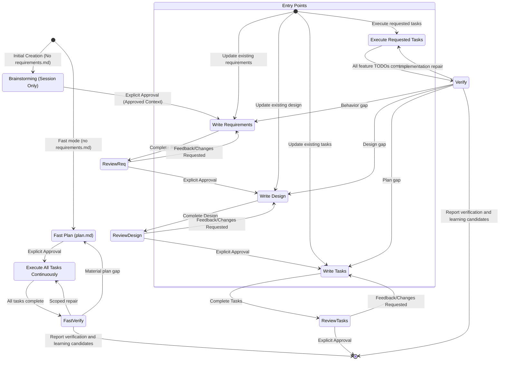

# LazySpec

## Rule
- The output content should all be in chinese, except the key word from the project

## Resource Loading

Load only resources required by the selected route.

| Route | Required resources |
|---|---|
| brainstorming | risk-policy, approval-policy |
| requirements | risk-policy, approval-policy, doc-policy |
| design | risk-policy, approval-policy, doc-policy |
| tasks | risk-policy, approval-policy, doc-policy, delivery-loop |
| execute | risk-policy, approval-policy, delivery-loop |
| fast | risk-policy, approval-policy, delivery-loop |
| orchestration | risk-policy, approval-policy, delivery-loop |
| memory-recall | memory-recall |
| memory-distill | approval-policy |
| codex-plan-adapter | codex-plan-mode |

Rules:
- Load the routed Skill after selecting the route.
- Load conditional resources only when their route or condition applies.
- Do not preload every reference at session start.
- A routed Skill may load its own prompt/template/resources.
- Resolve every reference from this Skill's `references/` directory; if a resource is unavailable, report the missing resource rather than inventing a policy.

[approval-policy.md](references/approval-policy.md) is the single source of approval semantics (explicit approval, materiality, invalidation, the Human-First `审批摘要` contract, and the approval-asking protocol); [risk-policy.md](references/risk-policy.md) defines risk classification and verification depth; [delivery-loop.md](references/delivery-loop.md) defines execution, Feature Verification, repair, and learning candidates; [doc-policy.md](references/doc-policy.md) defines minimum-sufficient documentation; [memory-recall.md](references/memory-recall.md) and [codex-plan-mode.md](references/codex-plan-mode.md) are loaded only by their own routes above.

## Approval Contract

The approval contract for Requirements and Design documents — the Chinese `审批摘要` as the user-facing approval object, materiality classification, summary/body consistency, invalidation and revision deltas, and legacy migration — is defined exclusively in approval-policy.md. Routing and phase scoping keep only these rules:

- Normal Specs approve Requirements, Design, and Tasks separately in that order; fast approves its plan; Brainstorming keeps its Context approval; Memory approves its exact write preview; multi-Spec orchestration approves its complete `orchestration.md`.
- Every downstream phase MUST treat an approved `审批摘要` as the upper-level material contract while continuing to read the complete Spec body for implementation detail.

## Brainstorming Human-First Conversation Contract

The user-facing Brainstorming conversation follows the Human-First Interaction rules defined in `brainstorming/SKILL.md`. Apply them only to that conversation; they do not create a new artifact, change the internal `BrainstormingContext` schema, or alter Requirements, Design, Tasks, fast mode, or Memory behavior.

## Routing Protocol
Use this Skill as the single entry point. Route by logical Skill name and read only that Skill's required resources; do not copy a phase's detailed body here.

Before inspecting or writing any Spec artifact, bind `ACTIVE_PROJECT_ROOT` to the user's project working directory at the start of the current agent session. Resolve every `specs/{feature_name}/...` path against that directory. Never derive `ACTIVE_PROJECT_ROOT` from this Skill's directory, a registered Skill location, the Plugin repository, or a Plugin cache. If the session working directory is unavailable or ambiguous, ask the user for the project root before writing; never default to the Plugin installation directory.

Resolve every routed Skill with this platform-neutral protocol:

1. Prefer the current environment's registered Skill invocation mechanism. Use the logical names `brainstorming`, `writing-requirement`, `writing-design`, `writing-task`, `distill-spec-memory`, `fast`, and `orchestrating-specs`; a Claude Code Plugin may expose them as `lazyspec:<logical-name>`, while an Agent Skills installation may expose the unnamespaced logical name.
2. If no registered Skill invocation mechanism is available, or the logical Skill is not registered, read its sibling `SKILL.md` using the fallback mapping below. Resolve the path relative to this `using-lazyspec/SKILL.md`, never relative to the process working directory or repository root.
3. After resolving the target, follow that Skill's instructions and resolve its supporting files by the target Skill's own resource rules.

| Logical name | Registered Claude Code name | Relative fallback |
|---|---|---|
| `brainstorming` | `lazyspec:brainstorming` | `../brainstorming/SKILL.md` |
| `writing-requirement` | `lazyspec:writing-requirement` | `../writing-requirement/SKILL.md` |
| `writing-design` | `lazyspec:writing-design` | `../writing-design/SKILL.md` |
| `writing-task` | `lazyspec:writing-task` | `../writing-task/SKILL.md` |
| `distill-spec-memory` | `lazyspec:distill-spec-memory` | `../distill-spec-memory/SKILL.md` |
| `fast` | `lazyspec:fast` | `../fast/SKILL.md` |
| `orchestrating-specs` | `lazyspec:orchestrating-specs` | `../orchestrating-specs/SKILL.md` |

### Memory Distillation Routing

- Route to `distill-spec-memory` only when the user explicitly asks to preserve or maintain Feature/Learning Memory, requests candidate promotion, or confirms a Learning Candidate for preview. Automatic candidate collection follows delivery-loop.md and does not authorize Memory writes.
- Do not infer a distillation request from task completion. Collect valuable learning candidates in the task/plan artifact only; exact Memory write approval remains separate.
- After routing, follow `distill-spec-memory` without changing the normal LazySpec phase order or approval gates.

### Fast Mode Routing

- For new features, route to `fast` only when the user explicitly asks for fast mode (keywords such as `fast` or `快速`, or a direct `fast` / `lazyspec:fast` invocation). Also route explicit requests to execute, verify, or revise an existing fast plan.md to fast; this resumes its existing mode rather than inferring fast for a new feature.
- Fast creation and subsequent plan operations are allowed only when the target feature has no `specs/{feature_name}/requirements.md`. If `requirements.md` already exists, keep the request on the normal chain, report in Chinese why fast mode was declined, and route by the ordinary rules below.
- A `fast` request is an ordinary LazySpec request: apply Memory Recall Routing before routing, and pass `RelevantMemoryContext` to `fast` as advisory input.
- Never choose fast for a new feature by inference. Without an explicit fast-mode request or an explicit operation on an existing fast plan, use the normal chain.

### Multi-Spec Orchestration Routing

- Route to `orchestrating-specs` only when the user explicitly asks to jointly execute, orchestrate, or implement multiple approved Specs. Never infer an orchestration request from the mere existence of multiple Specs; single-Spec requests keep the normal chain unchanged.
- An orchestration request is an ordinary LazySpec request: apply Memory Recall Routing before routing, and pass `RelevantMemoryContext` to `orchestrating-specs` as advisory input.
- `specs/orchestration.md` only coordinates cross-Spec execution — Spec-level ordering, dependencies, parallelism, stacked branches, and integration verification. It is not a new planning layer, does not override approved Spec content, and does not govern how tasks inside any individual Spec are executed; gaps between Specs route back to the affected Spec's Requirements/Design/Tasks revision.

### Memory Recall Routing

For every ordinary LazySpec request, after binding `ACTIVE_PROJECT_ROOT` and before selecting the phase Skill, build a session-only `RelevantMemoryContext` by following [memory-recall.md](references/memory-recall.md) exactly. An explicit Memory distillation request routes directly to `distill-spec-memory`; it does not receive an unrelated default recall context.

Inspect the requested feature's `specs/{feature_name}/requirements.md`, `design.md`, and `tasks.md` under `ACTIVE_PROJECT_ROOT`, the user's request, and explicit approvals available in the current conversation. Do not infer approval from file existence.

### Codex Plan Mode 适配

Codex Plan Mode 只作为新功能创建前的 Brainstorming 输入来源，不是新的 LazySpec 阶段；完整适配协议见 [codex-plan-mode.md](references/codex-plan-mode.md)。路由决策只保留以下规则：

- 运行时明确报告 Codex Plan Mode 且计划已批准时，有效产物直接路由到 `writing-requirement`，不得调用标准 `brainstorming`；计划批准前不得调用 `writing-requirement`。
- 已知处于非 Codex 环境或 Codex 非 Plan Mode 时，继续走标准 `brainstorming`；平台或模式无法确认时不得自动选择任一分支，必须停留并要求用户明确切换到标准 Brainstorming 或补充有效的 Codex Plan Mode 计划。
- 当已有 `requirements.md` 且用户未明确要求重新规划时，继续直接进入 `writing-requirement`，不得因适配自动修改既有 Spec 文件。

### Phase Chain

1. For the first creation of `requirements.md`, when that file does not exist:
   - Apply the Codex Plan Mode adapter when the runtime explicitly reports Codex Plan Mode; route an approved non-empty plan directly to `writing-requirement` without invoking standard `brainstorming`.
   - Otherwise, when the runtime is known to be non-Codex or not in Plan Mode, route to `brainstorming`.
   - Do not route to `writing-requirement` until the selected input has been explicitly approved. Standard Brainstorming still requires a session context containing objective, scope, constraints, success criteria, and selected approach.
   - When the runtime platform or mode is unknown, stop and require an explicit route choice instead of guessing.
   - After the approved context is available, route to `writing-requirement`.

2. For a revision of an existing `requirements.md`:
   - Route directly to `writing-requirement` by default.
   - Route to `brainstorming` first only when the user explicitly requests it.
   - Brainstorming updates only conversation context; do not modify a Spec artifact unless separately requested.

3. Route to `writing-design` only after explicit approval of the current Requirements, and to `writing-task` only after explicit approval of the current Design. Create one normal-phase document at a time and request its approval before advancing, at every risk level. Approval of a prior phase never approves the next one.

4. For questions about existing Spec tasks or requests to execute or verify an existing task plan, apply the task instructions below and delivery-loop.md. Verification-only requests do not authorize implementation repairs. Answer task questions without starting work; when execution is explicitly requested, follow the full TODO scope stated by the user.

## Workflow Diagram

The phase-review edges below apply to every normal Spec. Each review must receive explicit approval before the next phase document is created.

## Task Instructions

- These executing instructions apply to normal tasks.md plans; route fast plan.md execution to fast and the shared delivery loop. The complete execution contract — reading the full Spec contract before executing, confirming approvals, batch TODO execution, feature-branch creation, checkbox token semantics, verification, handoff Memory impact candidates, and stale Feature Verification completion — is defined in [delivery-loop.md](references/delivery-loop.md). Follow it exactly.
- Answer task-information requests without modifying code, Spec files, or checkbox state. For example, if the user asks what the next task is, provide the information without starting any task.

## Approval Protocol
Apply approval-policy.md as the single source of approval semantics: create and approve Requirements, Design, and Tasks one at a time at every risk level, using approval-policy.md's asking protocol at each gate. Routing adds only these rules:

- Present only the current phase document for approval. For Requirements and Design, review the Human-First `审批摘要` and its consistency with the detailed body; Tasks keeps the complete task document as its approval object.
- Never generate Design before Requirements approval or Tasks before Design approval; risk level and decision impact do not alter these gates.
