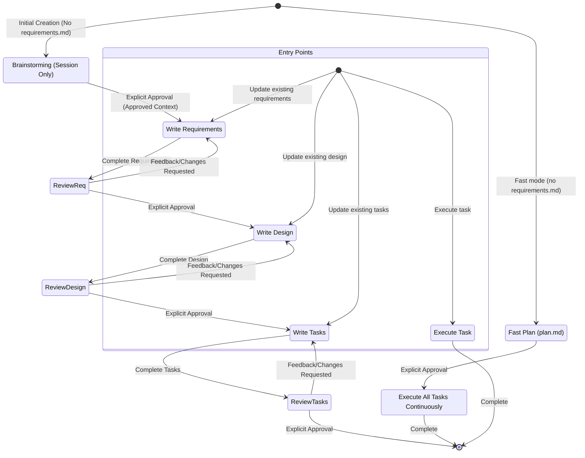

# LazySpec

## Rule
- The output content should all be in chinese, except the key word from the project

## Minimum-Sufficient Documentation
- Default to the shortest document that remains reviewable, verifiable, and executable.
- Put information in exactly one phase: Requirements define observable behavior, Design records implementation decisions, and Tasks identify coding actions and automated verification.
- Refer to upstream requirement IDs instead of restating upstream content. Do not repeat the same rationale, constraint, or procedure in multiple sections.
- Expand a section only when omitting it would create a material implementation ambiguity or the user explicitly requests more detail. An explicit request expands only the relevant section; it does not enable a separate verbose mode.
- Treat phase length targets as soft limits. Before exceeding one, remove repetition, merge closely related items, or recommend splitting an oversized Spec. Never truncate distinct approved behavior merely to meet a target.

## Routing Protocol
Use this Skill as the single entry point. Route by logical Skill name and read only that Skill's required resources; do not copy a phase's detailed body here.

Before inspecting or writing any Spec artifact, bind `ACTIVE_PROJECT_ROOT` to the user's project working directory at the start of the current agent session. Resolve every `specs/{feature_name}/...` path against that directory. Never derive `ACTIVE_PROJECT_ROOT` from this Skill's directory, a registered Skill location, the Plugin repository, or a Plugin cache. If the session working directory is unavailable or ambiguous, ask the user for the project root before writing; never default to the Plugin installation directory.

Resolve every routed Skill with this platform-neutral protocol:

1. Prefer the current environment's registered Skill invocation mechanism. Use the logical names `brainstorming`, `writing-requirement`, `writing-design`, `writing-task`, `distill-spec-memory`, and `fast`; a Claude Code Plugin may expose them as `lazyspec:<logical-name>`, while an Agent Skills installation may expose the unnamespaced logical name.
2. If no registered Skill invocation mechanism is available, or the logical Skill is not registered, read its sibling `SKILL.md` using the fallback mapping below. Resolve the path relative to this `using-lazyspec/SKILL.md`, never relative to the process working directory or repository root.
3. After resolving the target, follow that Skill's instructions and resolve its supporting files by the target Skill's own resource rules.

| Logical name | Registered Claude Code name | Relative fallback |
|---|---|---|
| `brainstorming` | `lazyspec:brainstorming` | `../brainstorming/SKILL.md` |
| `writing-requirement` | `lazyspec:writing-requirement` | `../writing-requirement/SKILL.md` |
| `writing-design` | `lazyspec:writing-design` | `../writing-design/SKILL.md` |
| `writing-task` | `lazyspec:writing-task` | `../writing-task/SKILL.md` |
| `distill-spec-memory` | `lazyspec:distill-spec-memory` | `../distill-spec-memory/SKILL.md` |
| `fast` | `lazyspec:fast` | `../fast/SKILL.md` |

### Memory Distillation Routing

- Route to `distill-spec-memory` only when the user explicitly asks to preserve, archive, or distill a completed Feature Spec into project Memory.
- Do not infer a distillation request from completing a task or from ordinary Brainstorming, Requirements, Design, Tasks, task questions, or task execution.
- After routing, follow `distill-spec-memory` without changing the normal LazySpec phase order or approval gates.

### Fast Mode Routing

- Route to `fast` only when the user explicitly asks for the fast mode (keywords such as `fast` or `快速`, or a direct `fast` / `lazyspec:fast` invocation) for a new feature.
- Fast mode is only for first-time creation: route to `fast` only when the target feature has no `specs/{feature_name}/requirements.md`. If `requirements.md` already exists, keep the request on the normal chain, report in Chinese why fast mode was declined, and route by the ordinary rules below.
- A `fast` request is an ordinary LazySpec request: apply Memory Recall Routing before routing, and pass `RelevantMemoryContext` to `fast` as advisory input.
- Never route to `fast` by inference. Without an explicit fast-mode request, always use the normal chain.

### Memory Recall Routing

For every ordinary LazySpec request, after binding `ACTIVE_PROJECT_ROOT` and before selecting the phase Skill, build a session-only `RelevantMemoryContext`. An explicit Memory distillation request routes directly to `distill-spec-memory`; it does not receive an unrelated default recall context.

1. Check only `ACTIVE_PROJECT_ROOT/project-memory/index.md`. If it does not exist, use an empty context and continue the original route. Do not create an index or scan `project-memory/features/` as a fallback.
2. Parse the generated six-column index header and Markdown-linked rows. If the marker, header, columns, path, or status is malformed, report a non-fatal Chinese maintenance warning, use an empty context (or retain only independently valid rows), and continue the original route. Never guess a path, synthesize a missing row, or rewrite the index during recall.
3. For default recall, consider only rows whose index status is `active`. Resolve each Memory link against `ACTIVE_PROJECT_ROOT`; reject absolute paths, `..` traversal, paths outside `project-memory/features/`, missing Capsules, invalid frontmatter, missing `reviewed_at` or `authorities`, or Capsule/index mismatches. Report each rejected row and do not scan other files to compensate.
4. Rank valid candidates by query matches in `feature`, `tags`, `Summary`, and `Source Spec`, in that order of signal strength; break ties by the project-root-relative Memory path. Read the complete Capsule only after ranking, and select at most three. If more than three match, report the selected paths and that the remaining matches were omitted.
5. Expose the result only as this session's context; never write it into a Spec or project file:

```ts
interface RelevantMemoryContext {
  readonly query: string;
  readonly memories: readonly {
    readonly path: string;
    readonly status: "active";
    readonly sourceSpec: string;
    readonly reviewedAt: string;
    readonly authorities: readonly string[];
    readonly relevantSections: readonly string[];
  }[]; // 0–3 items
}
```

6. If there is no related valid `active` row, use an empty context and continue. If the user explicitly asks to trace history or review Memory status, select up to three matching `needs-review`, `superseded`, or `obsolete` rows separately, preserve their actual status, and attach a Chinese warning that they are not current facts. Never place a non-`active` item in `memories` or present it without the warning.
7. Pass `RelevantMemoryContext` as advisory input to the selected phase. If the request changes or disputes a listed authority, read that current authority and its relevant source/tests before relying on the Capsule. Memory may inform questions, requirements, design, tasks, or implementation, but it must not override current implementation evidence, approve a phase, reorder Brainstorming → Requirements → Design → Tasks, bypass a task gate, or expand the one-task execution boundary. A missing index, no hit, omitted-over-three result, or maintenance warning is never a phase error.

Inspect the requested feature's `specs/{feature_name}/requirements.md`, `design.md`, and `tasks.md` under `ACTIVE_PROJECT_ROOT`, the user's request, and explicit approvals available in the current conversation. Do not infer approval from file existence.

### Codex Plan Mode 适配

Codex 原生 Plan Mode 只作为新功能创建前的 Brainstorming 输入来源，不是新的 LazySpec 阶段。适配只依赖 Codex 运行时明确提供的模式标记，不猜测环境变量、文件名、用户措辞或其他信号。

```ts
interface RuntimeMode {
  readonly platform: "codex" | "non-codex" | "unknown";
  readonly planMode: "active" | "inactive" | "unknown";
}

interface CodexPlanArtifact {
  readonly source: "codex-plan-mode";
  readonly content: string;
  readonly approved: true;
}

type BrainstormingInput =
  | BrainstormingContext
  | CodexPlanArtifact;
```

只有当 `RuntimeMode.platform` 为 `codex`、`RuntimeMode.planMode` 为 `active`、计划原文 `content.trim()` 非空，并且用户已明确批准该原生计划时，才建立 `CodexPlanArtifact`。适配层不要求固定章节、字段或额外头部；传递给 Requirements 的 `content` 必须是批准时的完整原文。`CodexPlanArtifact` 与运行时标记只保留在当前会话中，不序列化或写入项目文件。

在首次创建且不存在 `requirements.md` 时，Codex Plan Mode 的有效产物直接路由到 `writing-requirement`，其 `RouteDecision.stage` 仍为 `"requirements"`；不得调用标准 `brainstorming`。计划批准前不得调用 `writing-requirement`。已知处于非 Codex 环境或 Codex 非 Plan Mode 时，继续走标准 `brainstorming`；平台或模式无法确认时不得自动选择任一分支，必须停留并要求用户明确切换到标准 Brainstorming 或补充有效的 Codex Plan Mode 计划。

1. For the first creation of `requirements.md`, when that file does not exist:
   - Apply the Codex Plan Mode adapter above when the runtime explicitly reports Codex Plan Mode; route an approved non-empty plan directly to `writing-requirement` without invoking standard `brainstorming`.
   - Otherwise, when the runtime is known to be non-Codex or not in Plan Mode, route to `brainstorming`.
   - Do not route to `writing-requirement` until the selected input has been explicitly approved. Standard Brainstorming still requires a session context containing objective, scope, constraints, success criteria, and selected approach.
   - When the runtime platform or mode is unknown, stop and require an explicit route choice instead of guessing.
   - After the approved context is available, route to `writing-requirement`.

2. For a revision of an existing `requirements.md`:
   - Route directly to `writing-requirement` by default.
   - Route to `brainstorming` first only when the user explicitly requests it.
   - Brainstorming updates only conversation context; do not modify a Spec artifact unless separately requested.

3. For Design, route to `writing-design` only after Requirements has explicit user approval. For Tasks, route to `writing-task` only after Design has explicit user approval. Preserve each downstream Skill's approval gate.

4. For questions about existing Spec tasks or requests to execute an existing task, apply the task instructions below. Answer task questions without starting work, and execute only one requested task at a time.

## Workflow Diagram



## Task Instructions

### Executing Instructions
- Before executing any task, ALWAYS read the feature's complete `requirements.md`, `design.md`, and `tasks.md` in the current execution context. Executing a task without all three artifacts is forbidden.
- Look at the task details in the task list; start with sub-tasks if present.
- When the user explicitly requests execution of a `tasks.md` plan, execute all currently unchecked TODOs in their listed order, including their sub-tasks, without waiting for per-task approval or another user instruction. If the user explicitly names one TODO number, limit execution to that TODO and its sub-tasks.
- Before the first file modification, create a new feature branch by default using `codex/<feature-name>` (or the user's explicitly requested branch name). If the default branch name already belongs to unrelated work, use a unique `codex/` branch name and report the choice. Do not commit unrelated pre-existing changes.
- Verify implementation against any requirements specified in the task or its details.
- When marking a completed task in `tasks.md`, change only its checkbox token from `[ ]` to `[x]`. Preserve `//TODO` and every character after it exactly; do not remove, replace, or rewrite the task text.
- After each TODO passes its verification, stage only that TODO's related files, update only its checkbox token, and create a separate commit before continuing. The commit must preserve the original `//TODO` text and must not include unrelated working-tree changes.
- Continue through all requested unchecked TODOs without an intentional pause. Stop only for an actual verification failure, merge or working-tree conflict, commit failure, missing user decision, or user interruption, and report the exact blocker.
- When all requested TODOs are complete, inspect only the Project Memory index for Capsules whose feature, tags, summary, Source Spec, or authorities overlap the changed paths. Report likely impact candidates in the handoff, but do not create, edit, or re-status Memory without a separate explicit distillation or maintenance request.
- If the task file has no unchecked TODOs, report that it is already complete. If the requested task file or TODO cannot be resolved, ask for the exact path or number before modifying files.

### Task Questions
Answer task-information requests without modifying code, Spec files, or checkbox state. For example, if the user asks what the next task is, provide the information without starting any task.

## Approval Protocol
After every Requirements, Design, or Tasks update or revision, request approval in this order:

1. If `AskUserQuestion` is available, call it with only its supported `questions` input. Use one question object with `question`, `header`, `options`, and `multiSelect`; use `Review` as the header, the two single-choice options `Approve` and `Request changes`, and `multiSelect: false`. Do not add unsupported top-level or question fields.
2. Otherwise, if the environment provides an equivalent user-question tool, use it with the same single-choice meaning and only fields supported by that tool.
3. Otherwise, ask the phase's approval question directly in the conversation and stop while awaiting the answer.

- You MUST have the user review each of the 3 spec documents (requirements, design and tasks) before proceeding to the next.
- Only an explicit approval in the current conversation (a clear "yes", "approved", selecting `Approve`, or equivalent affirmative response) records approval. File existence, timeout, silence, explanations, ambiguous replies, and requested changes do not imply approval.
- You MUST NOT proceed to the next phase until you receive explicit approval from the user.
- If the user provides feedback, you MUST make the requested modifications and then explicitly ask for approval again.
- Follow workflow steps sequentially without skipping or combining phases.
