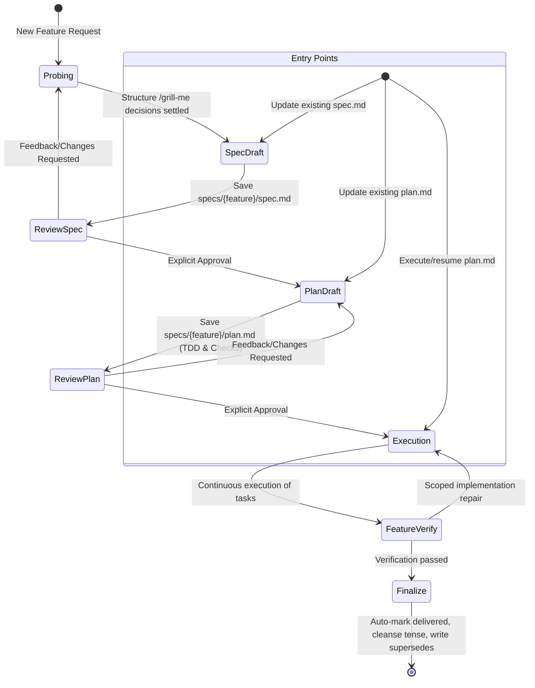

# LazySpec

## Rule
- The output content should all be in chinese, except the key word from the project

## Resource Loading

Load only resources required by the selected route.

| Route | Required resources |
|---|---|
| spec | risk-policy, approval-policy, doc-policy |
| plan | risk-policy, approval-policy, doc-policy, delivery-loop |
| execute | risk-policy, approval-policy, delivery-loop |
| fast | risk-policy, approval-policy, delivery-loop |
| orchestration | risk-policy, approval-policy, delivery-loop |
| memory-recall | memory-recall |
| memory-distill | approval-policy |

Rules:
- Load the routed Skill after selecting the route.
- Load conditional resources only when their route or condition applies.
- Do not preload every reference at session start.
- A routed Skill may load its own prompt/template/resources.
- Resolve every reference from this Skill's `references/` directory; if a resource is unavailable, report the missing resource rather than inventing a policy.

[approval-policy.md](references/approval-policy.md) is the single source of approval semantics (explicit approval, materiality, invalidation, complete-file review, and the shared user-question protocol); [risk-policy.md](references/risk-policy.md) defines risk classification and verification depth; [delivery-loop.md](references/delivery-loop.md) defines shared Feature Verification, automated delivery finalization, repair, and learning candidates; `executing-plan` owns plan execution and delivery finalization; [doc-policy.md](references/doc-policy.md) defines minimum-sufficient documentation; [memory-recall.md](references/memory-recall.md) is loaded only by its own route above.

## Approval Contract

The complete-file approval contract, materiality classification, invalidation, and revision deltas are defined exclusively in approval-policy.md. Routing and phase scoping keep only these rules:

- Specs approve `spec.md` and `plan.md` separately in that order; fast approves its plan; Memory approves its exact write preview; multi-Spec orchestration approves its complete `orchestration.md`.
- Downstream phase MUST use the approved upstream document's material content as its contract; use approval-policy.md and the routed Skill to determine detail-reading depth.

## Routing Protocol
Use this Skill as the single entry point. Route by logical Skill name and read only that Skill's required resources; do not copy a phase's detailed body here.

Before inspecting or writing any Spec artifact, bind `ACTIVE_PROJECT_ROOT` to the user's project working directory at the start of the current agent session. Resolve every `specs/{feature_name}/...` path against that directory. Never derive `ACTIVE_PROJECT_ROOT` from this Skill's directory, a registered Skill location, the Plugin repository, or a Plugin cache. If the session working directory is unavailable or ambiguous, ask the user for the project root before writing; never default to the Plugin installation directory.

Resolve every routed Skill with this platform-neutral protocol:

1. Prefer the current environment's registered Skill invocation mechanism. Use the logical names `writing-spec`, `writing-plan`, `executing-plan`, `distill-feature`, `distill-learning`, `maintain-memory`, `fast`, `orchestrating-specs`; a Claude Code Plugin may expose them as `lazyspec:<logical-name>`, while an Agent Skills installation may expose the unnamespaced logical name.
2. If no registered Skill invocation mechanism is available, or the logical Skill is not registered, read its sibling `SKILL.md` using the fallback mapping below. Resolve the path relative to this `using-lazyspec/SKILL.md`, never relative to the process working directory or repository root.
3. After resolving the target, follow that Skill's instructions and resolve its supporting files by the target Skill's own resource rules.

| Logical name | Registered Claude Code name | Relative fallback |
|---|---|---|
| `writing-spec` | `lazyspec:writing-spec` | `../writing-spec/SKILL.md` |
| `writing-plan` | `lazyspec:writing-plan` | `../writing-plan/SKILL.md` |
| `executing-plan` | `lazyspec:executing-plan` | `../executing-plan/SKILL.md` |
| `distill-feature` | `lazyspec:distill-feature` | `../distill-feature/SKILL.md` |
| `distill-learning` | `lazyspec:distill-learning` | `../distill-learning/SKILL.md` |
| `maintain-memory` | `lazyspec:maintain-memory` | `../maintain-memory/SKILL.md` |
| `fast` | `lazyspec:fast` | `../fast/SKILL.md` |
| `orchestrating-specs` | `lazyspec:orchestrating-specs` | `../orchestrating-specs/SKILL.md` |

### Negative Guardrails Inspection

Before routing to `writing-spec` or initiating new feature planning:
- Inspect `specs/retired/` (or obsolete entries in `project-memory/`).
- If the requested capability or approach matches a retired/obsolete specification or negative guardrail, issue an immediate warning in Chinese citing the retirement reason and require user confirmation before proceeding, preventing the agent from repeating past mistakes.

### Memory Distillation & Governance Routing

- Route to `distill-feature` when the user explicitly requests distilling an already delivered feature Spec into a Feature Capsule.
- Route to `distill-learning` when capturing engineering observations, troubleshooting remedies, or negative guardrails into a Learning Capsule.
- Route to `maintain-memory` for memory and specs maintenance, supersession propagation, foundation archival, or index self-healing.
- Do not infer a distillation request from task completion. Collect valuable learning candidates in the plan artifact only; exact Memory write approval remains separate.

### Fast Mode Routing

- For new features, route to `fast` only when the user explicitly asks for fast mode (keywords such as `fast` or `快速`, or a direct `fast` / `lazyspec:fast` invocation). Also route explicit requests to execute, verify, or revise an existing fast plan.md to fast; this resumes its existing mode rather than inferring fast for a new feature.
- Fast creation and subsequent plan operations are allowed only when the target feature has no `specs/{feature_name}/spec.md`. If `spec.md` already exists, keep the request on the normal chain, report in Chinese why fast mode was declined, and route by the ordinary rules below.
- A `fast` request is an ordinary LazySpec request: apply Memory Recall Routing before routing, and pass `RelevantMemoryContext` to `fast` as advisory input.
- Never choose fast for a new feature by inference. Without an explicit fast-mode request or an explicit operation on an existing fast plan, use the normal chain.

### Multi-Spec Orchestration Routing

- Route to `orchestrating-specs` only when the user explicitly asks to jointly execute, orchestrate, or implement multiple approved Specs. Never infer an orchestration request from the mere existence of multiple Specs; single-Spec requests keep the normal chain unchanged.
- An orchestration request is an ordinary LazySpec request: apply Memory Recall Routing before routing, and pass `RelevantMemoryContext` to `orchestrating-specs` as advisory input.
- `specs/orchestration.md` only coordinates cross-Spec execution — Spec-level ordering, dependencies, parallelism, stacked branches, and integration verification. It is not a new planning layer, does not override approved Spec content, and does not govern how tasks inside any individual Spec are executed; gaps between Specs route back to the affected Spec's revision.

### Memory Recall Routing

For every ordinary LazySpec request, after binding `ACTIVE_PROJECT_ROOT` and before selecting the phase Skill, build a session-only `RelevantMemoryContext` by following [memory-recall.md](references/memory-recall.md) exactly.

Inspect the requested feature's `specs/{feature_name}/spec.md` and `plan.md` under `ACTIVE_PROJECT_ROOT`, the user's request, and explicit approvals available in the current conversation. Do not infer approval from file existence.

### Phase Chain (Binary Architecture)

1. **Phase 1: Spec Creation / Revision**:
   - For a new feature or revision of `spec.md`, route directly to `writing-spec`.
   - Conduct structured probing (/grill-me style) across requirements, architectural decisions, and mandatory alternatives considered.
   - Write the complete draft of `specs/{feature_name}/spec.md` only after probing is settled.
   - Present the saved file link to the user and await explicit approval.
2. **Phase 2: Plan Creation / Revision**:
   - Only after explicit approval of `spec.md`, route to `writing-plan`.
   - Break down implementation into behavioral TODO tasks with test-first entry points and explicit `## Feature Verification` checks.
   - Present the saved file link to the user and await explicit approval.
3. **Phase 3: Execution and Automated Delivery Finalization**:
   - For `plan.md` execution, resume, or verification requests, route to `executing-plan` and [delivery-loop.md](references/delivery-loop.md).
   - Execute tasks continuously within the approved plan scope.
   - Execute Feature Verification端到端验收.
   - Upon verification passing, automatically finalize delivery: in-place flip `spec.md` status to `delivered`, cleanse hypothetical phrasing into present-tense facts, and sync bidirectional `superseded` pointers if applicable.

## Workflow Diagram

```mermaid
stateDiagram-v2
  [*] --> Probing : New Feature Request
  Probing --> SpecDraft : Structure /grill-me decisions settled
  SpecDraft --> ReviewSpec : Save specs/{feature}/spec.md
  ReviewSpec --> Probing : Feedback/Changes Requested
  ReviewSpec --> PlanDraft : Explicit Approval
  
  PlanDraft --> ReviewPlan : Save specs/{feature}/plan.md (TDD & Checks)
  ReviewPlan --> PlanDraft : Feedback/Changes Requested
  ReviewPlan --> Execution : Explicit Approval

  Execution --> FeatureVerify : Continuous execution of tasks
  FeatureVerify --> Execution : Scoped implementation repair
  FeatureVerify --> Finalize : Verification passed
  Finalize --> [*] : Auto-mark delivered, cleanse tense, write supersedes

  state "Entry Points" as EP {
      [*] --> SpecDraft : Update existing spec.md
      [*] --> PlanDraft : Update existing plan.md
      [*] --> Execution : Execute/resume plan.md
  }
```

## Task Instructions

- Route normal `plan.md` execution and verification requests to `executing-plan`. Route fast `plan.md` execution to `fast`. Both use the shared [delivery-loop.md](references/delivery-loop.md) for Feature Verification, repair, and Learning Candidates.
- Answer task-information requests read-only without modifying code, Spec files, checkbox state, or the temporary progress record.

## Approval Protocol
Apply approval-policy.md as the single source of approval semantics: create and approve `spec.md` and `plan.md` one at a time at every risk level, using approval-policy.md's asking protocol at each gate.

- Save and internally check the complete current phase document, then point the user to its file for approval under approval-policy.md's File-backed review rule. `spec.md` and `plan.md` each use the complete saved phase document as their approval object. Do not repeat the draft in the conversation.
- Never generate `plan.md` before `spec.md` approval; risk level and decision impact do not alter these gates.
