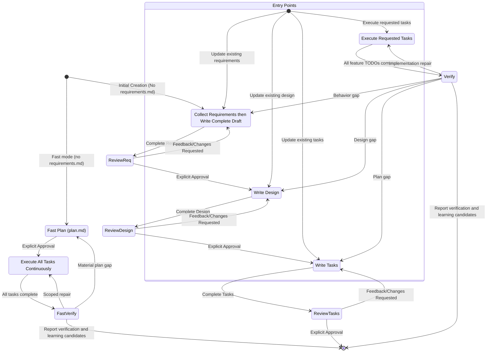

# LazySpec

## Rule
- The output content should all be in chinese, except the key word from the project

## Resource Loading

Load only resources required by the selected route.

| Route | Required resources |
|---|---|
| requirements | risk-policy, approval-policy, doc-policy |
| design | risk-policy, approval-policy, doc-policy |
| tasks | risk-policy, approval-policy, doc-policy, delivery-loop |
| execute | risk-policy, approval-policy, delivery-loop |
| fast | risk-policy, approval-policy, delivery-loop |
| orchestration | risk-policy, approval-policy, delivery-loop |
| memory-recall | memory-recall |
| memory-distill | approval-policy |

Rules:
- Load the routed Skill after selecting the route.
- Load conditional resources only when their route or condition applies.
- Do not preload every reference at session start.
- A routed Skill may load its own prompt/template/resources.
- Resolve every reference from this Skill's `references/` directory; if a resource is unavailable, report the missing resource rather than inventing a policy.

[approval-policy.md](references/approval-policy.md) is the single source of approval semantics (explicit approval, materiality, invalidation, complete-file review, and the shared user-question protocol); [risk-policy.md](references/risk-policy.md) defines risk classification and verification depth; [delivery-loop.md](references/delivery-loop.md) defines shared Feature Verification, repair, and learning candidates; `executing-task` owns normal task execution; [doc-policy.md](references/doc-policy.md) defines minimum-sufficient documentation; [memory-recall.md](references/memory-recall.md) is loaded only by its own route above.

## Approval Contract

The complete-file approval contract, materiality classification, invalidation, revision deltas, and legacy compatibility are defined exclusively in approval-policy.md. Routing and phase scoping keep only these rules:

- Normal Specs approve Requirements, Design, and Tasks separately in that order; fast approves its plan; Memory approves its exact write preview; multi-Spec orchestration approves its complete `orchestration.md`.
- Every downstream phase MUST use the approved upstream document's material content as its contract; use approval-policy.md and the routed Skill to determine detail-reading depth.

## Routing Protocol
Use this Skill as the single entry point. Route by logical Skill name and read only that Skill's required resources; do not copy a phase's detailed body here.

Before inspecting or writing any Spec artifact, bind `ACTIVE_PROJECT_ROOT` to the user's project working directory at the start of the current agent session. Resolve every `specs/{feature_name}/...` path against that directory. Never derive `ACTIVE_PROJECT_ROOT` from this Skill's directory, a registered Skill location, the Plugin repository, or a Plugin cache. If the session working directory is unavailable or ambiguous, ask the user for the project root before writing; never default to the Plugin installation directory.

Resolve every routed Skill with this platform-neutral protocol:

1. Prefer the current environment's registered Skill invocation mechanism. Use the logical names `writing-spec`, `writing-plan`, `executing-plan`, `distill-feature`, `distill-learning`, `maintain-memory`, `fast`, `orchestrating-specs`, as well as legacy compatibility names `writing-requirement`, `writing-design`, `writing-task`, `executing-task`, and `distill-spec-memory`; a Claude Code Plugin may expose them as `lazyspec:<logical-name>`, while an Agent Skills installation may expose the unnamespaced logical name.
2. If no registered Skill invocation mechanism is available, or the logical Skill is not registered, read its sibling `SKILL.md` using the fallback mapping below. Resolve the path relative to this `using-lazyspec/SKILL.md`, never relative to the process working directory or repository root.
3. After resolving the target, follow that Skill's instructions and resolve its supporting files by the target Skill's own resource rules.

| Logical name | Registered Claude Code name | Relative fallback |
|---|---|---|
| `writing-spec` | `lazyspec:writing-spec` | `../writing-spec/SKILL.md` |
| `writing-plan` | `lazyspec:writing-plan` | `../writing-plan/SKILL.md` |
| `executing-plan` | `lazyspec:executing-plan` | `../executing-plan/SKILL.md` |
| `distill-feature` | `lazyspec:distill-feature` | `../distill-feature/SKILL.md` |
| `distill-learning` | `lazyspec:distill-learning` | `../distill-learning/SKILL.md` |
| `maintain-memory` | `lazyspec:maintain-memory` | `../maintain-memory/SKILL.md` |
| `writing-requirement` | `lazyspec:writing-requirement` | `../writing-requirement/SKILL.md` |
| `writing-design` | `lazyspec:writing-design` | `../writing-design/SKILL.md` |
| `writing-task` | `lazyspec:writing-task` | `../writing-task/SKILL.md` |
| `executing-task` | `lazyspec:executing-task` | `../executing-task/SKILL.md` |
| `distill-spec-memory` | `lazyspec:distill-spec-memory` | `../distill-spec-memory/SKILL.md` |
| `fast` | `lazyspec:fast` | `../fast/SKILL.md` |
| `orchestrating-specs` | `lazyspec:orchestrating-specs` | `../orchestrating-specs/SKILL.md` |

### Memory Distillation & Governance Routing

- Route to `distill-feature` when the user explicitly requests distilling an already delivered feature Spec.
- Route to `distill-learning` when capturing engineering observations, troubleshooting remedies, or negative guardrails.
- Route to `maintain-memory` for memory and specs maintenance, supersession propagation, foundation archival, or index self-healing.
- Route to legacy `distill-spec-memory` only when the user explicitly asks to preserve or maintain Feature/Learning Memory, requests candidate promotion, or confirms a Learning Candidate for preview. Automatic candidate collection follows delivery-loop.md and does not authorize Memory writes.
- Do not infer a distillation request from task completion. Collect valuable learning candidates in the task/plan artifact only; exact Memory write approval remains separate.
- After routing, follow `distill-spec-memory` without changing the normal LazySpec phase order or approval gates.

### Negative Guardrails Inspection

Before routing to `writing-spec` or initiating new feature planning:
- Inspect `specs/retired/` (or obsolete entries in `project-memory/`).
- If the requested capability or approach matches a retired/obsolete specification or negative guardrail, issue an immediate warning in Chinese citing the retirement reason and require user confirmation before proceeding, preventing the agent from repeating past mistakes.

### Fast Mode Routing

- For new features, route to `fast` only when the user explicitly asks for fast mode (keywords such as `fast` or `快速`, or a direct `fast` / `lazyspec:fast` invocation). Also route explicit requests to execute, verify, or revise an existing fast plan.md to fast; this resumes its existing mode rather than inferring fast for a new feature.
- Fast creation and subsequent plan operations are allowed only when the target feature has no `specs/{feature_name}/requirements.md`. If `requirements.md` already exists, keep the request on the normal chain, report in Chinese why fast mode was declined, and route by the ordinary rules below.
- A `fast` request is an ordinary LazySpec request: apply Memory Recall Routing before routing, and pass `RelevantMemoryContext` to `fast` as advisory input.
- Never choose fast for a new feature by inference. Without an explicit fast-mode request or an explicit operation on an existing fast plan, use the normal chain.

### Multi-Spec Orchestration Routing

- Route to `orchestrating-specs` only when the user explicitly asks to jointly execute, orchestrate, or implement multiple approved Specs. Never infer an orchestration request from the mere existence of multiple Specs; single-Spec requests keep the normal chain unchanged.
- An orchestration request is an ordinary LazySpec request: apply Memory Recall Routing before routing, and pass `RelevantMemoryContext` to `orchestrating-specs` as advisory input.
- `specs/orchestration.md` only coordinates cross-Spec execution — Spec-level ordering, dependencies, parallelism, stacked branches, and integration verification. It is not a new planning layer, does not override approved Spec content, and does not govern how tasks inside any individual Spec are executed; gaps between Specs route back to the affected Spec's Requirements/Design/Tasks revision.

### Memory Recall Routing

For every ordinary LazySpec request, after binding `ACTIVE_PROJECT_ROOT` and before selecting the phase Skill, build a session-only `RelevantMemoryContext` by following [memory-recall.md](references/memory-recall.md) exactly. An explicit Memory distillation request routes directly to `distill-spec-memory`; it does not receive an unrelated default recall context.

Inspect the requested feature's `specs/{feature_name}/spec.md` (or legacy `requirements.md`, `design.md`, and `tasks.md`) under `ACTIVE_PROJECT_ROOT`, the user's request, and explicit approvals available in the current conversation. Do not infer approval from file existence.

### Phase Chain

1. For the first creation of `requirements.md`, route directly to `writing-requirement` (in v2 binary architecture, route new feature requests directly to `writing-spec`). That Skill conducts structured probing (/grill-me style) and writes the complete draft only after confirmation is complete. No separate context approval or platform-specific plan adapter is required. Supplied plans are ordinary background and cannot bypass requirement collection. Respect the host environment's current tool and file-writing restrictions.
2. For a revision of an existing `requirements.md`, route directly to `writing-requirement`, which collects only additions, material changes, and removals while retaining unchanged requirements.
3. Route to `writing-design` only after explicit approval of the current Requirements, and to `writing-task` (or v2 `writing-plan`) only after explicit approval of the current Design (or `spec.md`). Create one normal-phase document at a time and request its approval before advancing, at every risk level. Approval of a prior phase never approves the next one.
4. For ordinary `tasks.md` execution, resume, or verification-only requests, route to `executing-task` (in v2: `executing-plan`) and the shared delivery-loop.md. Verification-only requests do not authorize implementation repairs. Answer task-status questions read-only without starting work; when execution is explicitly requested, pass the full TODO scope stated by the user to `executing-task`.

## Workflow Diagram

The phase-review edges below apply to every normal Spec. Each review must receive explicit approval before the next phase document is created.

```mermaid
stateDiagram-v2
  [*] --> Requirements : Initial Creation (No requirements.md)

  Requirements : Collect Requirements then Write Complete Draft
  Design : Write Design
  Tasks : Write Tasks

  Requirements --> ReviewReq : Complete Requirements
  ReviewReq --> Requirements : Feedback/Changes Requested
  ReviewReq --> Design : Explicit Approval
  
  Design --> ReviewDesign : Complete Design
  ReviewDesign --> Design : Feedback/Changes Requested
  ReviewDesign --> Tasks : Explicit Approval
  
  Tasks --> ReviewTasks : Complete Tasks
  ReviewTasks --> Tasks : Feedback/Changes Requested
  ReviewTasks --> [*] : Explicit Approval
  
  Execute : Execute Requested Tasks

  FastPlan : Fast Plan (plan.md)
  FastExecute : Execute All Tasks Continuously

  [*] --> FastPlan : Fast mode (no requirements.md)
  FastPlan --> FastExecute : Explicit Approval
  FastExecute --> FastVerify : All tasks complete
  FastVerify --> FastExecute : Scoped repair
  FastVerify --> FastPlan : Material plan gap
  FastVerify --> [*] : Report verification and learning candidates

  state "Entry Points" as EP {
      [*] --> Requirements : Update existing requirements
      [*] --> Design : Update existing design
      [*] --> Tasks : Update existing tasks
      [*] --> Execute : Execute requested tasks
  }

  Execute --> Verify : All feature TODOs complete
  Verify --> Execute : Implementation repair
  Verify --> Requirements : Behavior gap
  Verify --> Design : Design gap
  Verify --> Tasks : Plan gap
  Verify --> [*] : Report verification and learning candidates
```

## Task Instructions

- Route normal `tasks.md` execution and verification-only requests to `executing-task`, which owns progressive per-TODO context, approved scope, branch, checkbox, commits, handoff, and temporary progress. Route fast `plan.md` execution to `fast`. Both use the shared [delivery-loop.md](references/delivery-loop.md) for Feature Verification, repair, and Learning Candidates.
- Answer task-information requests without modifying code, Spec files, checkbox state, or the temporary progress record. For example, if the user asks what the next task is, provide the information without starting any task.

## Approval Protocol
Apply approval-policy.md as the single source of approval semantics: create and approve Requirements, Design, and Tasks one at a time at every risk level, using approval-policy.md's asking protocol at each gate. Routing adds only these rules:

- Save and internally check the complete current phase document, then point the user to its file for approval under approval-policy.md's File-backed review rule. Requirements, Design, and Tasks each use the complete saved phase document as their approval object. Do not repeat the draft in the conversation.
- Never generate Design before Requirements approval or Tasks before Design approval; risk level and decision impact do not alter these gates.
